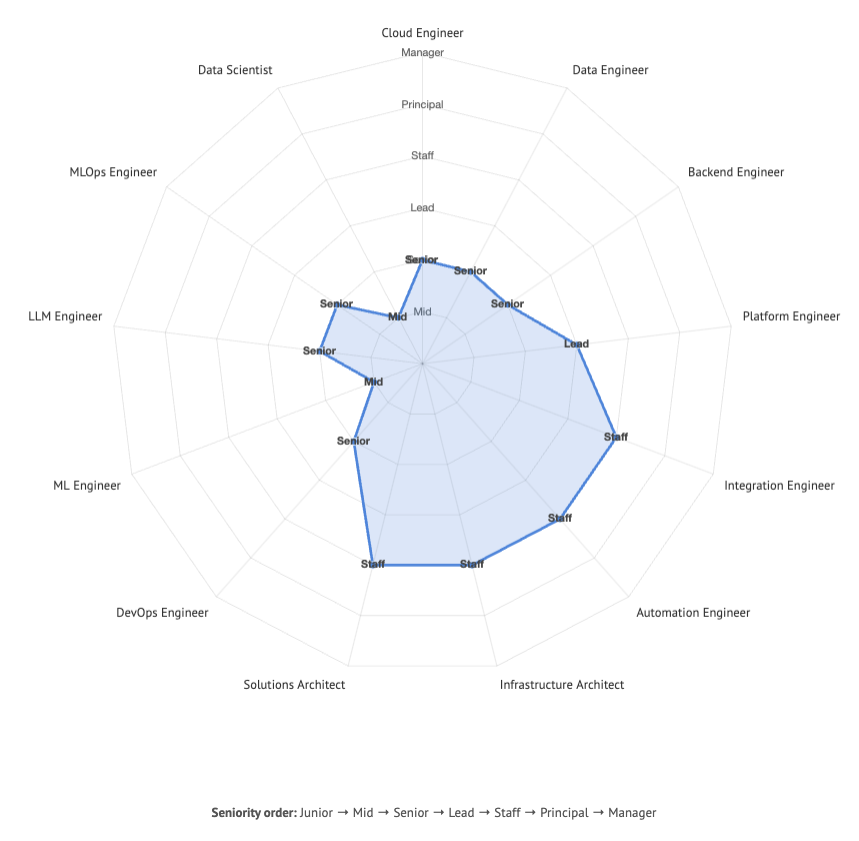

## Alex Chernysh

**Staff Solutions Architect & Glue Engineer**

Building the calm layer between chaos and clarity.

### What I Do

I architect and build resilient systems that connect everything — cloud, on-prem, and SaaS platforms. As a "glue engineer", I'm the technical leader others rely on to make complex systems just work.

I specialize in:
- End-to-end data/AI pipelines that stay rock-solid in production
- LLM-powered solutions (RAG, agents, automation)
- Platform stability and developer velocity

### Impact

- **Production-grade pipelines**: Processing 10K+ events/sec with <5s latency
- **LLM-powered automation**: Built a mini-ATS that cut candidate triage time by 70%
- **Security innovation**: Automated threat scoring pipeline saving 18 hrs/week
- **Open-source contribution**: Created modular RAG framework with hybrid retrieval

### Competency Chart

<!--  -->

### Philosophy

- Inventive ⇆ Pragmatic.
- Talks to both business people && terminal.
- Learning and sharing.

### Connect

[LinkedIn](https://www.linkedin.com/in/sasha-chernysh/) | [Email](mailto:alex@hireex.ai) | [Website](https://hireex.ai/)

Based in 🇮🇱.
