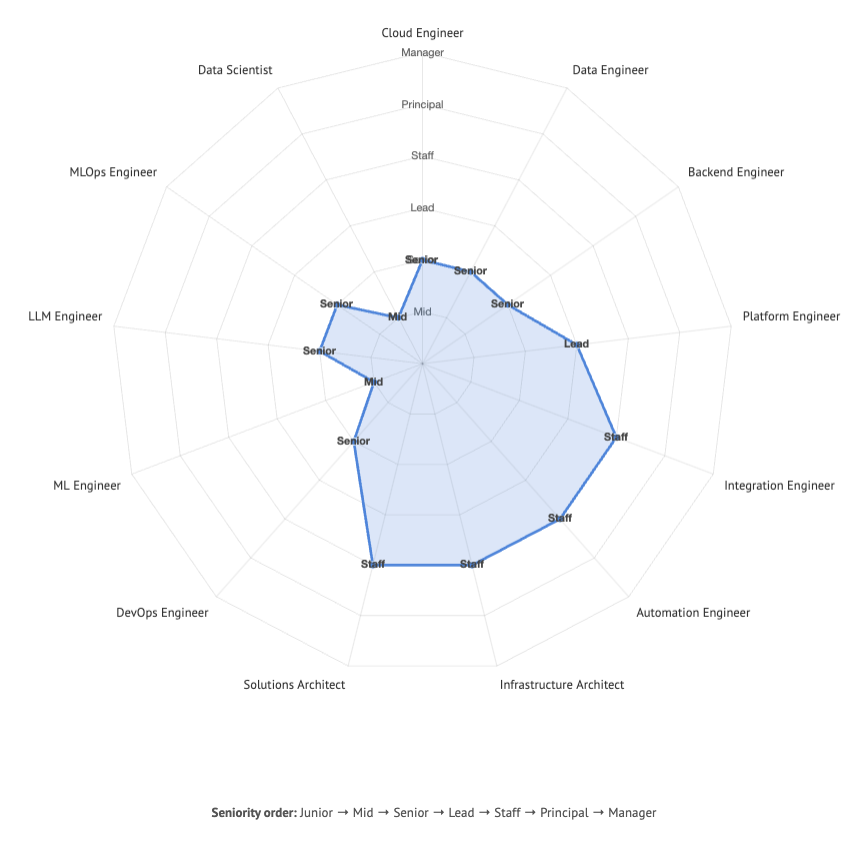

## Alex Chernysh

**Staff Solutions Architect & Glue Engineer**

Building the calm layer between chaos and clarity.

### What I Do

I architect and build resilient systems that connect everything — cloud, on-prem, and SaaS platforms. As a "glue engineer", I'm the technical leader others rely on to make complex systems just work.

I specialize in:
- End-to-end data/AI pipelines that stay rock-solid in production
- LLM-powered solutions (RAG, agents, automation)
- Platform stability and developer velocity

### Impact

- **Production-grade pipelines**: Processing 10K+ events/sec with <5s latency
- **LLM-powered automation**: Built a mini-ATS that cut candidate triage time by 70%
- **Security innovation**: Automated threat scoring pipeline saving 18 hrs/week
- **Open-source contribution**: Created modular RAG framework with hybrid retrieval

### Skills

Core: Python; FastAPI; LangGraph; Agentic RAG; LLM Integration (OpenAI/Claude); Qdrant; Redis; PostgreSQL; Docker; AWS (boto3); Observability (Prometheus/OTel); CI/CD.

Secondary: TypeScript/Node.js; Express; Next.js/React; Playwright (E2E); Supabase + Prisma; Telegram (Telethon); ETL/Redis Streams; Airflow/Prefect; Terraform/IaC; Kubernetes.


### Competency Chart

<!--  -->

```mermaid
%% Polygonal Competency Chart – Seniority per Role
radar-beta
  axis ce["Cloud Engineer"]
  axis de["Data Engineer"]
  axis be["Backend Engineer"]
  axis pe["Platform Engineer"]
  axis ie["Integration Engineer"]
  axis ae["Automation Engineer"]
  axis ia["Infrastructure Architect"]
  axis sa["Solutions Architect"]
  axis dev["DevOps Engineer"]
  axis ml["ML Engineer"]
  axis llm["LLM Engineer"]
  axis mlo["MLOps Engineer"]
  axis ds["Data Scientist"]

  curve seniority["Estimated seniority"]{3,3,3,4,5,5,5,5,3,2,3,3,2}
  showLegend false
  min 1
  max 7
  ticks 7
````

> 1 Junior → 2 Mid → 3 Senior → 4 Lead → 5 Staff → 6 Principal → 7 Manager


### Philosophy

- Inventive ⇆ Pragmatic.
- Talks to both business people && terminal.
- Learning and sharing.

### Connect

[LinkedIn](https://www.linkedin.com/in/sasha-chernysh/) | [Email](mailto:alex@hireex.ai) | [Website](https://hireex.ai/)

Based in 🇮🇱.
